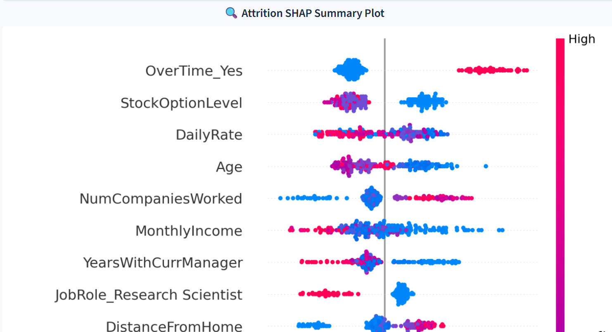

# 💼 HR Attrition Dashboard

Interactive analytics and explainability for employee attrition using Streamlit.

🔗 **Live demo:** [tchamna-humanresource-analytics.streamlit.app](https://tchamna-humanresource-analytics.streamlit.app/)

---


## 🚀 Quick Start (Local)

```powershell
pip install -r requirements.txt
streamlit run dashboard_streamlit.py
```

Preparing a production model (recommended)
- Generate a persistent pretrained model artifact used by both the dashboard:

```powershell
python scripts/train_model.py
# This creates model.pkl in the repo root
```


If `model.pkl` is present the dashboard will load it and use it for inference. If it's missing the dashboard will train a temporary model (for demo only) and you'll see a warning prompting you to create `model.pkl`.

Hosting
- Streamlit Cloud: push the repo to GitHub. On Streamlit Cloud create a new app pointing at `dashboard_streamlit.py`. Make sure `requirements.txt` is present and that `model.pkl` is checked in to the repo (or adapt the app to download it from a storage URL).
- Render: Use the provided `Dockerfile`/`Procfile` and point Render at the repo. Ensure `model.pkl` is included (or add a build step to fetch it) and set the start command to `uvicorn api_fastapi:app --host 0.0.0.0 --port $PORT` (for the API) or `streamlit run dashboard_streamlit.py --server.port $PORT` (for the dashboard).

Notes
- Do **not** commit large datasets to the repo; for `model.pkl` it's ok for small models but consider using object storage for larger artifacts.
- Add deployment manifests or a simple download step to fetch `model.pkl` from S3/GCP storage if you want to avoid checking the pickle into Git.

